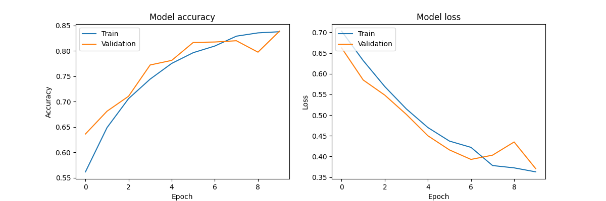

# Dogs vs Cats Image Classification | Deep Learning | Python

## Author: OUARAS Khelil Rafik

## Introduction

This project aims to classify images of dogs and cats using a Convolutional Neural Network (CNN) implemented in Python with TensorFlow. The model is trained on a dataset of dog and cat images, and the performance is evaluated based on accuracy and loss metrics. 

## Project Structure

- `train.py`: Script to train the CNN model using TensorFlow's Keras API. It includes data preprocessing, model creation, training, and saving the model.
- `predict.py`: Script to load the saved model and make predictions on new images.
- `model.py`: Contains the function to create the CNN model.
- `data_preprocessing.py`: Contains the function to create data generators for training and validation.
- `__init__.py`: Marks the directory as a Python package.

## Model Architecture

The CNN model is built using Keras with the following layers:
- Convolutional layers
- MaxPooling layers
- Dense layers
- Dropout layer

## Results

### Training and Validation Accuracy



### Training and Validation Loss


### Prediction Results


## Usage

### Training the Model

To train the model, run the following command:

```bash
python train.py
```

This will preprocess the data, train the model, and save the trained model to the `saved_models` directory.

### Making Predictions

To make predictions using the trained model, run the following command:

```bash
python predict.py
```

This will load the saved model and make predictions on the images in the `Datasets/test` directory.

## Requirements

- Python 3.12.4
- TensorFlow
- Keras
- Matplotlib
- Pandas
- Numpy

Install the required packages using:

```bash
pip install -r requirements.txt
```

## Conclusion

This project demonstrates how to build, train, and evaluate a CNN model for image classification. The trained model can distinguish between images of dogs and cats with high accuracy. The visualizations of the training process and the prediction results provide insights into the model's performance.
